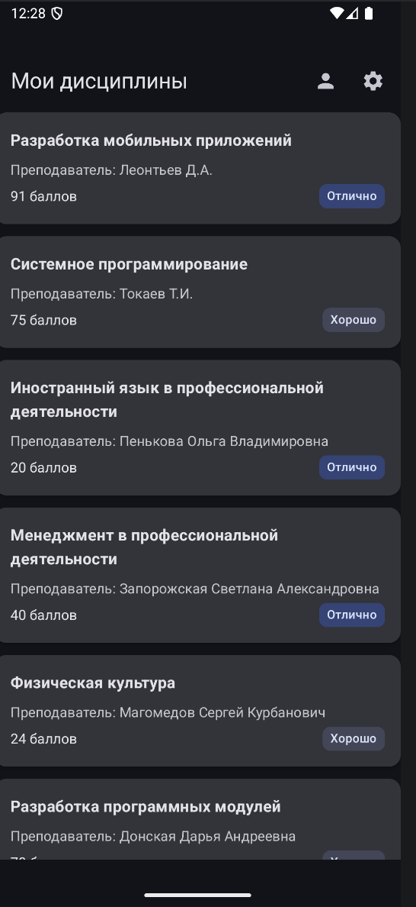
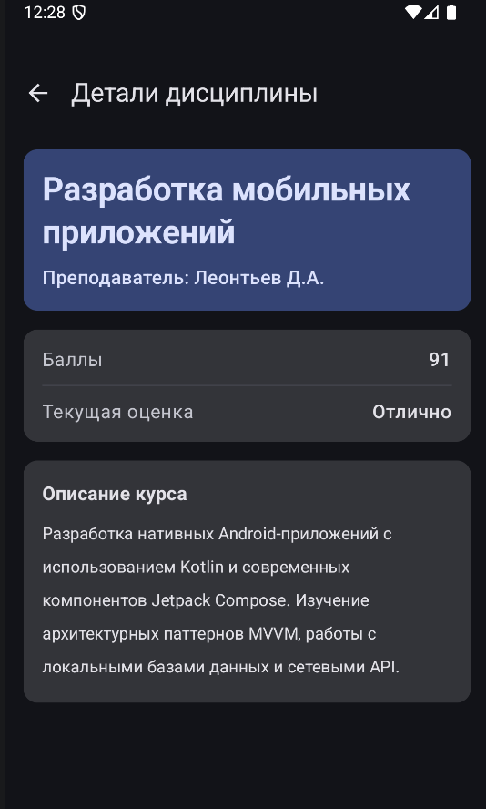
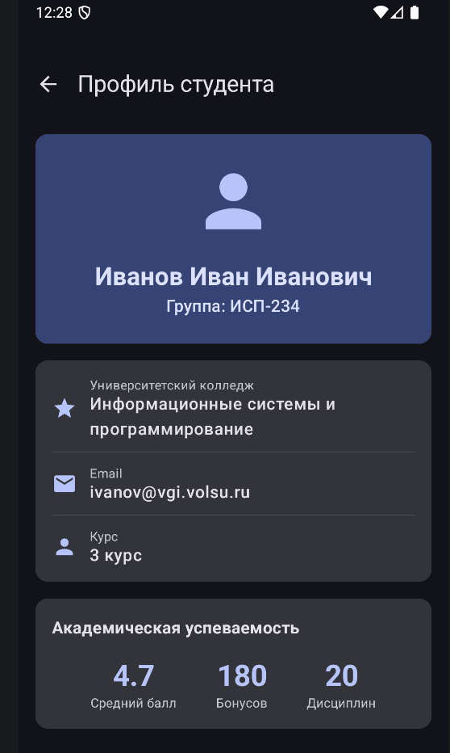
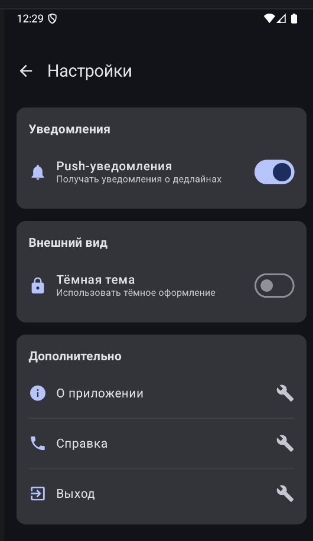
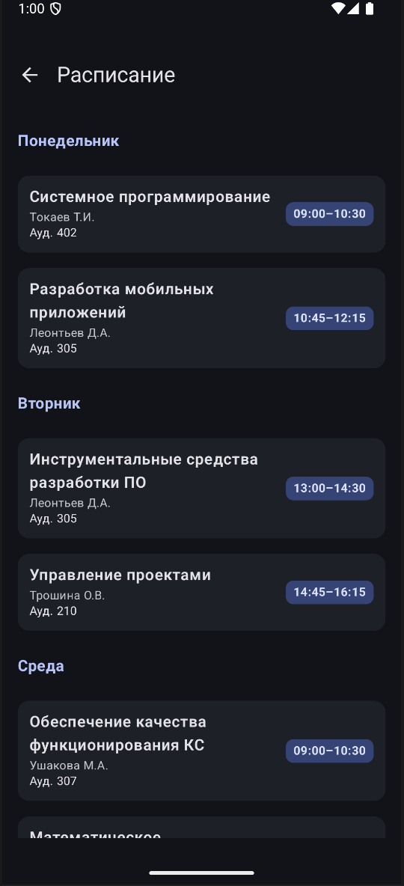

# Лабораторная работа №15-16. Navigation in Jetpack Compose

## Описание

Позволяет просматривать список дисциплин, получать подробную информацию о курсах, времени, управлять профилем и настройками. Приложение демонстрирует работу навигации и передачу данных между окон.

## Реализованные экраны

- Home (Список дисциплин)
- Details (Детали дисциплины)
- Profile (Профиль студента)
- Settings (Настройки)
- Calendar (Расписание пар)

## Используемые технологии

- Kotlin
- Jetpack Compose
- Navigation Compose

## Схема навигации

```
Home
 - Details (с параметром subjectId)
 - Profile
 - Settings
 - Calendar
```

## Скриншоты

<p align="left">
  <br>
  <br>
  <br>
  <br>
  <br>
</p>

---

# Контрольные вопросы

## 1. Что такое NavController и для чего он используется?

> [!NOTE]
> NavController - это основной компонент, который управляет навигацией в приложении.

Он отвечает за:

- переходы между экранами (navigate)
- хранение back stack
- обработку кнопки "Назад"

Почему используется `rememberNavController()`:

- сохраняет состояние при рекомпозиции
- предотвращает пересоздание контроллера
- обеспечивает корректную работу навигации

---

## 2. Как передать параметр в маршрут навигации?

Процесс:

1. Определение маршрута:

```kotlin
"details/{subjectId}"
```

2. Переход:

```kotlin
navController.navigate("details/123")
```

3. Получение:

```kotlin
val id = backStackEntry.arguments?.getString("subjectId")
```

> [!NOTE]
>
> - Обязательные параметры - должны быть переданы обязательно
> - Опциональные параметры - имеют значение по умолчанию и могут отсутствовать

---

## 3. Зачем использовать sealed class для маршрутов?

Преимущества:

- типобезопасность
- отсутствие ошибок в строках
- удобство поддержки
- автодополнение

> [!WARNING]
> Без sealed class легко допустить ошибку:
>
> ```kotlin
> navController.navigate("detials/123")
> ```
>
> Такой маршрут не будет найден

---

## 4. Что такое Back Stack и как им управлять?

Back Stack - это стек экранов (LIFO).

Схема:

```
Calendar
Settings
Profile
Home
```

Текущий экран - Settings

Что делает popBackStack():

- удаляет текущий экран
- возвращает к предыдущему (Profile)

---

## 5. Как работает startDestination в NavHost?

> [!NOTE]
> startDestination - это экран, который открывается первым

Пример:

```kotlin
startDestination = "home"
```

Первым будет экран Home

Можно ли изменить динамически:

- да, через условную логику или пересоздание NavHost

---

## 6. Что произойдет, если навигировать на несуществующий маршрут?

> [!WARNING]
> Приложение может завершиться с ошибкой (crash)

Как избежать:

- использовать sealed class
- проверять маршруты
- добавлять обработку ошибок

---

## 7. Зачем нужен параметр launchSingleTop?

> [!NOTE]
> launchSingleTop предотвращает создание дубликатов экранов

Проблема без него:

```
Home -> Profile -> Profile -> Profile
```

Решение:

```kotlin
navController.navigate("profile") {
    launchSingleTop = true
}
```

Результат:

- один экземпляр экрана в back stack
- стек не переполняется
